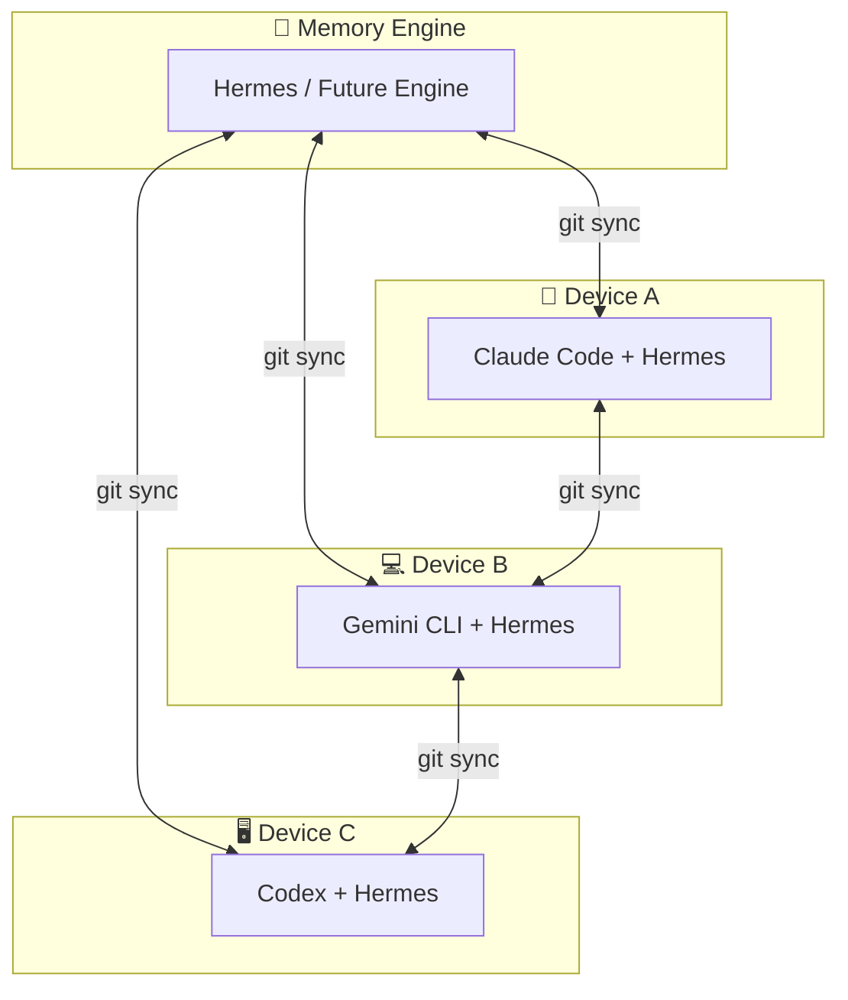
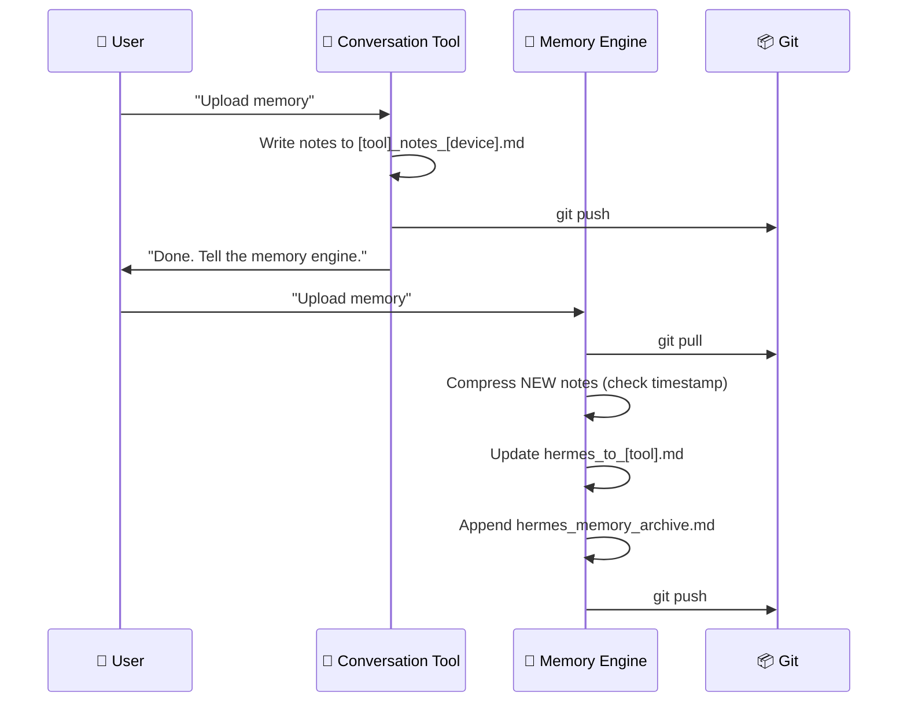
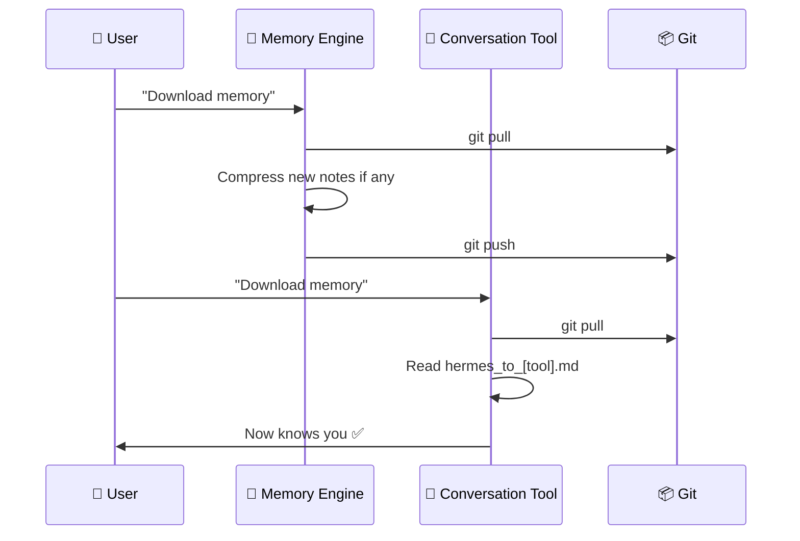

# 🧠 CortexNexus

[](LICENSE)
[](https://github.com/nicepkg/aide)
[](#architecture--架构)
[](#supported-tools--支持的工具)

**Cross-device AI memory synchronization protocol. One brain, every device.**

**跨设备 AI 记忆同步协议。一个大脑，所有设备。**

---

## 💬 The Elevator Pitch

You use Claude Code on your laptop, Gemini on your desktop, and Codex on your work machine. Each one treats you like a stranger. They don't know what you learned yesterday, what you prefer, or how you work.

CortexNexus fixes that.

It gives every AI tool on every device a shared memory — a single source of truth about who you are. The memory engine (currently [Hermes](https://github.com/nicepkg/aide)) compresses and maintains it. Your AI tools read it. You trigger sync when you want. No automation, no schedules, no leaks.

```
You: "Upload memory"   → AI writes notes   → memory engine compresses → git push
You: "Download memory" → memory engine pulls & compresses → AI reads summary
```

**Two commands. That's it.**

## 💬 一分钟介绍

你在笔记本上用 Claude Code，在台式机上用 Gemini，在公司用 Codex。每个工具都把你当陌生人——不知道你昨天学了什么、喜欢什么、工作习惯是什么。

CortexNexus 解决这个问题。

它给所有设备上的所有 AI 工具提供一份共享记忆——一份关于"你是谁"的唯一真相。记忆引擎（目前推荐 [Hermes](https://github.com/nicepkg/aide)）负责压缩和维护。你的 AI 工具负责读取。你决定什么时候同步。没有自动化、没有定时任务、没有信息泄漏。

```
你说"上传记忆"   → AI 写笔记   → 记忆引擎压缩 → git push
你说"下载记忆"   → 记忆引擎拉取并压缩 → AI 读简报
```

**两个命令，仅此而已。**

---

## 🏗️ Architecture / 架构



### 🎯 Core Roles / 核心角色

| Role | English | 中文 |
|------|---------|------|
| 🧠 Memory Engine | Compresses notes, maintains long-term memory, onboards new members | 压缩笔记，维护长期记忆，引导新成员接入 |
| 💬 Conversation Tool | Chats with user, writes brief notes, reads memory summary | 与用户对话，写简短笔记，读取记忆简报 |

### 🔑 Key Design / 核心设计

- **🧠 Memory Engine is the brain** — all compression and long-term storage handled by one tool
- **💬 Conversation tools are the interface** — they write notes, read summaries, nothing more
- **📁 Files are the bridge** — all tools exchange information through a shared Git repo
- **⚡ Two operations** — "Upload Memory" and "Download Memory", user-triggered, no automation
- **📚 Dual-layer memory** — short-term (overwritten) + long-term archive (append-only)
- **🔄 Tool-agnostic** — swap the memory engine or conversation tools without changing the protocol

---

## 🚀 Quick Start / 快速开始

### 1️⃣ Prerequisites / 前置条件

| Requirement | English | 中文 |
|-------------|---------|------|
| [Hermes](https://github.com/nicepkg/aide) | **Required** — this is the memory engine | **必须** — 记忆引擎 |
| Git | Version control | 版本控制 |
| GitHub account | Or any Git hosting service | 或其他 Git 托管服务 |
| Conversation tool | Claude Code, Gemini CLI, Codex, OpenCode, etc. | 对话工具，任选其一 |

### 2️⃣ Create Your Memory Repo / 创建记忆仓库

```bash
gh repo create my-memory --private
git clone https://github.com/YOUR_USERNAME/my-memory.git [YOUR_PATH]
cd [YOUR_PATH]
```

> **⚠️ Important:** Use a **private** repo — your memory contains personal information.
>
> **⚠️ 重要：** 请使用**私有**仓库——你的记忆包含个人信息。

### 3️⃣ Create Files from Templates / 从模板创建文件

Copy the templates from this repo's `templates/` folder and rename them:

```bash
cp templates/notes_template.md hermes_notes_[your_device].md
cp templates/notes_template.md claude_notes_[your_device].md
cp templates/skills_template.md hermes_skills_[your_device].md
cp templates/skills_template.md claude_skills_[your_device].md
cp templates/hermes_to_template.md hermes_to_claude.md
```

> 💡 Replace `[your_device]` with your device identifier. See [Naming Convention](#-naming-convention--命名规范).
>
> 💡 将 `[your_device]` 替换为你的设备标识。参见[命名规范](#-naming-convention--命名规范)。

### 4️⃣ Feed Prompts / 注入提示词

Copy the Hermes prompt from [SYSTEM_GUIDE.md](SYSTEM_GUIDE.md#5-hermes-prompt--hermes-提示词) and paste it into your Hermes instance.

For conversation tools, see [New Member Onboarding](#-new-member-onboarding--新成员接入).

### 5️⃣ Test / 测试

```
1. Chat with your conversation tool
2. Say "Upload memory"   → tool writes notes + pushes
3. Tell Hermes "Upload memory"   → Hermes compresses + pushes
4. On another device, tell Hermes "Download memory" → pulls + compresses
5. Start conversation tool → reads hermes_to_[tool].md → knows you ✅
```

---

## 🔧 Naming Convention / 命名规范

All files in the memory repo follow this pattern:

```
[member]_notes_[device].md     — Conversation notes / 对话笔记
[member]_skills_[device].md    — Skill inventory / 技能清单
hermes_to_[member].md          — Memory engine's guide for that member / 记忆引擎给该成员的指导
```

### 📋 Rules / 规则

| Part | English | 中文 | Example |
|------|---------|------|---------|
| `member` | Tool name, lowercase | 工具名，全小写 | `claude`, `hermes`, `gpt`, `gemini` |
| `device` | User-defined identifier, lowercase | 用户自定义标识，全小写 | `home`, `office`, `laptop` |
| `separator` | Underscore `_` only | 仅下划线 `_` | No hyphens or spaces |

### 📝 Examples / 示例

```
# Notes / 笔记
claude_notes_home.md          — Home device, Claude
gemini_notes_office.md        — Office device, Gemini

# Skills / 技能
hermes_skills_home.md         — Home device, Hermes
claude_skills_laptop.md       — Laptop, Claude

# Memory engine guides / 记忆引擎指导
hermes_to_claude.md           — Guide for Claude
hermes_to_gemini.md           — Guide for Gemini
```

### 🛡️ Error Handling / 错误处理

The memory engine checks naming on every sync:

| Issue | Action |
|-------|--------|
| Malformed filename | Notifies user, suggests correct name, helps rename |
| Missing device file | Notifies user, helps create it |
| User forgot the convention | Reads SYSTEM_GUIDE.md, explains the rules |

---

## 🔄 Workflow / 工作流程

### ⬆️ Upload Memory / 上传记忆



### ⬇️ Download Memory / 下载记忆



### ❓ Why Two Steps? / 为什么分两步？

The memory engine and conversation tools are separate processes — they cannot invoke each other. The shared Git repo is the bridge.

记忆引擎和对话工具是独立进程，无法直接调用对方。共享 Git 仓库是桥梁。

> **💡 Order matters / 顺序很重要：**
> - **Upload:** Conversation tool writes FIRST → Memory engine compresses SECOND
> - **Download:** Memory engine pulls & compresses FIRST → Conversation tool reads SECOND

---

## 📚 Dual-Layer Memory / 双层记忆

| Layer | File | Update Method | Read Frequency |
|-------|------|---------------|----------------|
| ⚡ Short-term | `hermes_to_[member].md` | Overwritten each time | Every session start |
| 📖 Long-term | `hermes_memory_archive.md` | Append-only, never deleted | On demand |

- **⚡ Short-term** = compact, current state, minimal context usage
- **📖 Long-term** = full history, growing over time, read when deep context needed

---

## 🤝 New Member Onboarding / 新成员接入

When a new AI tool joins the system:

### Step 1: Create Files / 创建文件

```
[member]_notes_[device].md
[member]_skills_[device].md
hermes_to_[member].md
```

### Step 2: Update README / 更新 README

Add the new member to the file table.

### Step 3: Feed Prompt / 注入提示词

Use this template:

```
You are a new member of a shared memory system.

Read these files first:
- [your-memory-repo]/README.md
- [your-memory-repo]/SYSTEM_GUIDE.md

Your member name: [member_name]
Your device identifier: [device_id]
Your notes file: [member]_notes_[device].md
Your skills file: [member]_skills_[device].md

## On startup
1. cd [memory-repo] && git pull
2. Read hermes_to_[your_member].md (the memory engine's guide)
3. Work normally

## When user says "Upload memory"
1. Write brief notes to [member]_notes_[device].md
2. Update [member]_skills_[device].md (if changed)
3. git add . && git commit && git push
4. Tell user: "Done. Tell the memory engine to upload memory."

## When user says "Download memory"
1. Tell user: "Ask the memory engine to download memory first."
2. After it's done: git pull
3. Read hermes_to_[your_member].md

## Key principles
- hermes_to_[your_member].md is your primary source of knowledge about the user
- Write brief notes only — the memory engine handles compression
- Follow naming conventions strictly
```

### Step 4: Memory Engine Confirms / 记忆引擎确认

Tell the memory engine a new member has joined. It will verify file names and format.

---

## 📱 New Device Setup / 新设备接入

See [SYSTEM_GUIDE.md](SYSTEM_GUIDE.md#6-new-device-setup--新设备接入) for the complete guide.

---

## 🛠️ Supported Tools / 支持的工具

### 🧠 Memory Engine (Required) / 记忆引擎（必须）

| Tool | Notes |
|------|-------|
| [Hermes](https://github.com/nicepkg/aide) | Current recommended engine. MCP, skills, long-term memory. |

### 💬 Conversation Tools (Optional) / 对话工具（可选）

| Tool | Type | Notes |
|------|------|-------|
| [Claude Code](https://github.com/anthropics/claude-code) | CLI | Anthropic's terminal agent |
| [Gemini CLI](https://github.com/google-gemini/gemini-cli) | CLI | Google's terminal agent |
| [Codex](https://github.com/openai/codex) | CLI | OpenAI's terminal agent |
| [OpenCode](https://github.com/opencode-ai/opencode) | CLI | Open-source alternative |

> 💡 Any tool that can read/write `.md` files and execute `git` commands can join.

---

## 📄 License / 许可证

[MIT](LICENSE)

---

## 🙏 Credits / 致谢

Built with [Hermes](https://github.com/nicepkg/aide) as the memory engine.

基于 [Hermes](https://github.com/nicepkg/aide) 作为记忆引擎构建。

---

**Author:** [atsyty](https://github.com/atsyty)
